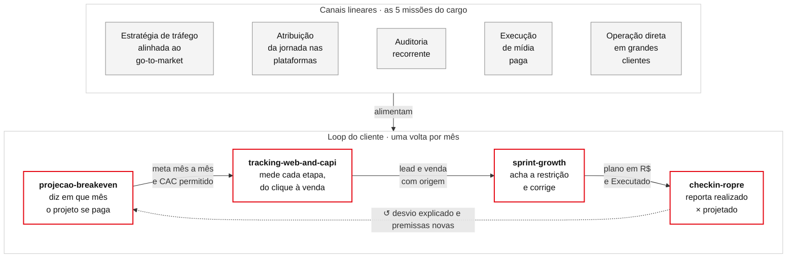
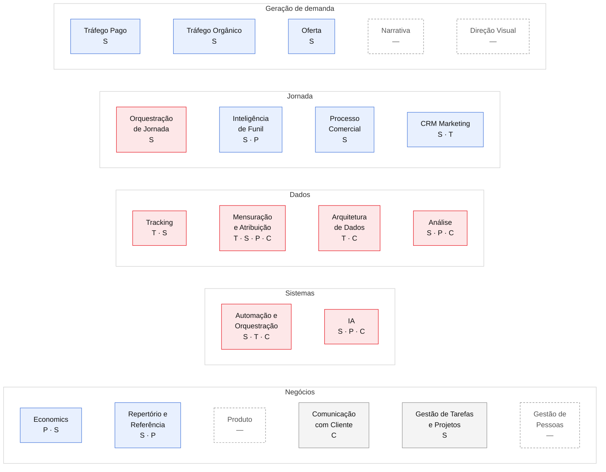

# growth-enginner

Skills do Claude Code para o trabalho de growth engineer em agência: projetar, medir, diagnosticar e reportar a
receita do cliente, do clique à venda. Cada skill é uma etapa de um mesmo loop, e cada uma cobre um conjunto das
disciplinas do PDI de growth engineer.

Todo README de skill tem as mesmas três camadas: o **desenho** (as fases, para ler em 30 segundos), o
**"Como funciona"** (uma linha por fase: o que entra, o que a skill faz, a ferramenta, o que sai e o que trava) e o
**detalhe completo** no `SKILL.md` ou, no check-in, na especificação do workflow.

## O loop

Desenho no formato de modelo qualitativo de crescimento (Reforge): as missões do cargo entram como canais lineares,
e as skills formam o loop. Cada passo é uma ação, termina onde o próximo começa e deixa uma saída que pode ser medida.

| Passo | Missão que alimenta | Ação | Saída | Como se mede |
|---|---|---|---|---|
| [`projecao-breakeven`](projecao-breakeven/) | Estratégia de tráfego alinhada ao go-to-market | Lê o histórico, faz a entrevista das premissas e dá o veredito | Planilha com meta mês a mês, CAC permitido e o caminho quando não fecha | Mês de breakeven; projetado de leads, MQL e vendas |
| [`tracking-web-and-capi`](tracking-web-and-capi/) | Atribuição da jornada nas plataformas | Planeja, gera os containers GTM web e servidor pelo template (com validação), audita e conserta Pixel/CAPI, Google Ads, GA4 e CRM | Cada lead e venda chega à plataforma e ao CRM com a origem | Eventos que disparam; conversões com rótulo certo; leads com origem ÷ leads; venda de volta às plataformas |
| [`sprint-growth`](sprint-growth/) | Auditoria recorrente · Execução de mídia paga | Audita a jornada inteira com 8 agentes especialistas em paralelo (mídia, medição, Clarity, jornada, comercial, mercado), acha a restrição (TOC) e executa pelas MCPs | Plano 5W1H priorizado em R$ e aba Executado | Impacto em R$/mês de cada ação; CPL real por pessoa única |
| [`checkin-ropre`](checkin-ropre/) | Operação direta em grandes clientes | Monta o check-in (Resultados, Objetivos, Premissas e riscos, Entregas, Próximos passos) | Deck e documento com a regra de atribuição declarada | Realizado × projetado; o que não foi medido escrito como tal |

## As disciplinas

As 21 disciplinas do PDI de growth engineer, por domínio. A cor é a profundidade esperada no cargo; as letras dizem
qual skill exercita a disciplina (**P** projeção, **T** tracking, **S** sprint, **C** check-in). Borda tracejada =
nenhuma skill cobre ainda.

Legenda: vermelho = Maximizar · azul = Sólido · cinza = Conhecer · tracejado = lacuna.

| Disciplina | Profundidade | Onde a skill exercita |
|---|---|---|
| Orquestração de Jornada | Maximizar | **S**: destino de cada anúncio, página, formulário, WhatsApp e CRM desenhados de ponta a ponta |
| Tracking | Maximizar | **T**: plano e implantação; **S**: auditoria do GTM, disparo real das tags, formulário interceptado |
| Mensuração e Atribuição | Maximizar | **T**: origem até o CRM; **S**: CPL real por pessoa única; **P**: fonte oficial do realizado; **C**: regra de atribuição declarada |
| Arquitetura de Dados | Maximizar | **T**: planilha, n8n e CRM; **C**: ETL extrair, transformar, carregar |
| Análise | Maximizar | **S**: funil estratificado, lead novo × cliente antigo, tempo por etapa; **P**: taxas efetivas; **C**: indicadores do período |
| Automação e Orquestração | Maximizar | **S**: MCPs de Google Ads, GTM e GA4; **T**: n8n e Apps Script; **C**: workflow de agentes |
| IA | Maximizar | As quatro são skills de agente; **S** e **C** usam agentes em paralelo |
| Tráfego Pago | Sólido | **S**: auditoria A1–A10, termos e negativas, criativo × qualidade do lead |
| Tráfego Orgânico | Sólido | **S**: SEO on-page e técnico da página que recebe o tráfego |
| Oferta | Sólido | **S**: oferta do anúncio × oferta da página |
| Inteligência de Funil | Sólido | **S**: onde o funil vaza; **P**: taxa por etapa |
| Processo Comercial | Sólido | **S**: motivos de perda, time, tempo até a primeira ação |
| CRM Marketing | Sólido | **S**: CRM pela API, etiquetas, disparo em massa; **T**: venda offline de volta às plataformas |
| Economics | Sólido | **P**: breakeven, margem, CAC permitido; **S**: impacto em R$ de cada ação |
| Repertório e Referência | Sólido | **S**: pesquisa de mercado e concorrentes; **P**: benchmarks com fonte |
| Comunicação com Cliente | Conhecer | **C**: check-in ROPRE |
| Gestão de Tarefas e Projetos | Conhecer | **S**: 5W1H com status e aba Executado |
| Narrativa · Direção Visual · Produto · Gestão de Pessoas | Sólido / Conhecer | Lacunas: nenhuma skill ainda |

Nenhuma pasta traz dado de cliente: cada skill gera sua cópia pública com o cliente trocado pelo segmento.
