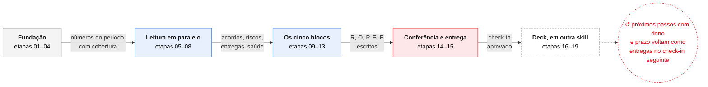

# Check-in ROPRE

**O check-in de cliente como workflow de agentes: do dado bruto ao deck da reunião, com a regra de
atribuição declarada e o que não foi medido escrito na cara.**

Toda agência responde as mesmas cinco perguntas no check-in — **R**esultados, **O**bjetivos,
**P**remissas e riscos, **E**ntregas, **E** próximos passos. Na prática, cada pessoa monta do seu
jeito: número que sai de planilha lançada à mão, ROAS calculado sobre uma base que parou de
atualizar semanas atrás, e uma reunião inteira discutindo por que a apresentação mostra mais venda
que o CRM.

Este repositório resolve isso de duas formas, e as duas usam as mesmas definições:

| | O que é | Para quê |
| --- | --- | --- |
| **O workflow** | 19 etapas encadeadas — 15 do check-in e 4 do deck — cada uma com briefing, entradas e saídas | roda dentro da plataforma de workflows, onde os dados já chegam pelo pipeline |
| **A implementação de referência** | ETL em Python, testado | confere se o workflow chegou ao número certo, e atende quem ainda não está na plataforma |

---

## O workflow

O arquivo que se importa é [`workflow/checkin-ropre.workflow.json`](workflow/checkin-ropre.workflow.json).
Este resumo, a tabela abaixo e a [especificação completa](referencias/workflow_v4os.md) saem do mesmo JSON
(`python3 workflow/render_spec.py`), então não divergem.

<!-- resumo:inicio -->

<!-- resumo:fim -->

Legenda: cinza = abertura · azul = leitura e escrita · vermelho = trava (conferência) · verde = entrega ·
tracejado = outra skill · ↺ = onde o loop se fecha. Na seta entre as fases, a saída de cada uma.

### Como funciona

Uma linha por fase. "Trava" é o que impede a fase seguinte. As 19 etapas, com briefing, entradas, saídas,
ferramentas, parâmetros e cuidados, estão na [especificação](referencias/workflow_v4os.md), junto com o
desenho etapa a etapa, o passo a passo de import no V4OS e o que ainda depende da plataforma.

<!-- fases:inicio -->
| Fase | Etapas | Entra | O que faz | Servidores | Sai | Trava |
| --- | --- | --- | --- | --- | --- | --- |
| **1 · Fundação** | 01, 02, 03, 04 | projeto (do contexto do V4 OS ou do formulário); cadência (`quinzenal` \| `mensal` \| `quarter`); data de referência | Abre o período e as premissas, confere até que dia cada fonte tem dado, puxa a base e calcula os indicadores | V4 OS, BigQuery · Ligações, Cockpit Colli, Dados Flow | pacote de números do período; com o período anterior ao lado | Fonte que não cobre o período: o indicador sai "não medido", com o motivo e o último dia com dado |
| **2 · Leitura em paralelo** | 05, 06, 07, 08 | transcrições das calls do período; grupo do cliente; projeto no ekyte; projeto; saída da etapa 01 | Call, WhatsApp, entregas e horas, sinais do cockpit, ao mesmo tempo (nenhum depende do outro) | BigQuery · Ligações, BigQuery · WhatsApp, eKyte, Cockpit Colli | acordos; pendências e riscos; com data; pendências abertas com data e o que trava; entregas realizadas; previstas e horas dedicadas; health score e variação; churn ou renovação no horizonte; NPS recente | Sem a fonte, o bloco diz que não tem; nada é estimado |
| **3 · Os cinco blocos** | 09, 10, 11, 12, 13 | metas cadastradas; backlog; saídas das etapas 01, 02, 04, 05, 06, 07, 08 | Resultados, Objetivos, Premissas e riscos, Entregas, Próximos passos; cada bloco consome o que precisa | Dados Flow | bloco R escrito; bloco O; bloco P; bloco de Entregas; bloco de Próximos Passos | Número novo nascendo na escrita: todo valor tem de existir no pacote da etapa 04 |
| **4 · Conferência e entrega** | 14, 15 | saídas das etapas 02, 03, 04, 09, 10, 11, 12, 13 | Reconta direto da base e bloqueia se não bater; entrega o check-in aprovado e o documento de revisão | V4 OS | check-in em formato de consumo para a skill de deck; documento de revisão | Número que não bate com a base volta como lista de correções |
| **5 · Deck, em outra skill** | 16, 17, 18, 19 | saída da etapa 15 | `checkin-colli` organiza a narrativa; `account-checkin-ropre-v2` compila no design system, faz o QA visual e publica | account-checkin-ropre-v2 | deck publicado para a reunião; documento de registro | Número recalculado ou "não medido" sumindo na diagramação reprova o QA |
<!-- fases:fim -->

### Por que a etapa 02 existe

Na primeira execução real, o check-in devolveu **ROAS de 37 e taxa de entrada no CRM de 720%**. Os
dois números estavam aritmeticamente corretos: a base de um dos canais de mídia tinha parado de
atualizar semanas antes, então o mês ficou com a receita inteira e só uma fração do investimento.

Modelo nenhum pega isso lendo o resultado — o número parece ótimo. Pega-se **antes**, conferindo até
que dia cada fonte tem dado. Daí a etapa de cobertura vir antes do cálculo, e o indicador que depende
de fonte furada sair como "não medido", com o motivo e o último dia com dado.

### As leis que viajam em cada briefing

Com o cálculo acontecendo em etapa de modelo, regra escrita uma vez no topo não serve: ela precisa
estar dentro da tarefa. Estas entram no briefing de toda etapa que toca número.

<!-- leis:inicio -->
1. **Cobertura antes de conta.** Nenhum indicador que dependa de uma fonte é calculado antes de a etapa 02 dizer que aquela fonte cobre o período inteiro. Fonte incompleta → o indicador sai **"não medido"**, com o motivo e o último dia com dado.
2. **Definição é fixa, não é escolha.** Faturamento lê **data de fechamento**. Safra lê **data de criação**. Recorrente é o **funil de recorrência**, não o campo de venda base. Atribuição é a **regra declarada no projeto**, e ela aparece escrita no deck.
3. **Lacuna é resposta.** Nunca preencher buraco com média, proporção, estimativa ou "mês anterior". Não medir e dar zero são coisas diferentes, e as duas são diferentes de "estável".
4. **Número novo não nasce na escrita.** Todo valor citado nos blocos tem de existir na saída da etapa de cálculo. Quem escreve o bloco não recalcula nada.
<!-- leis:fim -->

---

## De onde vêm os dados

O check-in não fala com ferramenta de cliente uma a uma. Ele consome a **plataforma de dados da
companhia** (o Flow), que já concentra tudo, e onde um **pipeline de ingestão** (o Nekt) sincroniza
as contas de cada projeto para um data warehouse. Isso muda o que o check-in precisa saber: em vez de
uma integração por cliente, existe **um identificador de projeto** e, a partir dele, a plataforma
resolve qual conta, qual tabela e qual fonte responder.

O acesso é por servidores MCP, um por domínio, todos já ligados dentro do V4OS. Nenhum endereço ou
credencial mora neste repositório.

Os nomes abaixo são os do painel **Ferramentas** do V4OS; a chave é como este repositório os chama.
Dois deles — Dados Flow e Catálogo de Produtos — usam o **token pessoal do Flow** de quem roda e vêm
desligados no chat. O painel avisa que o que se liga no chat não altera workflows: no workflow, cada
etapa liga os servidores que chama.

<!-- servidores:inicio -->
| No V4OS | Chave aqui | O que responde | Entra em | Acesso | Etapas |
| --- | --- | --- | --- | --- | --- |
| **Dados Flow** | `dados-flow` | tudo que o pipeline sincroniza do projeto: CRM, mídia paga, analytics, e-commerce, operações, social orgânico, as conexões com o estado de cada uma, e as metas do período | cobertura (02), base (03) e metas (10) — blocos R e O | token pessoal do Flow; no chat vem desligado por padrão | 02, 03, 10 |
| **Cockpit Colli** | `cockpit` | cadastro do projeto, health score e histórico, entradas e saídas (churn, aviso prévio, renovação), expansão, NPS e simulações de break-even | projeto (01) e sinais de risco (08) — blocos O e P | credencial da plataforma | 01, 08 |
| **BigQuery · Ligações** | `bigquery-calls` | as calls do projeto no período, com trecho de transcrição | acordos, pendências e riscos da call (05) — bloco O e Próximos Passos | credencial da plataforma | 01, 05 |
| **BigQuery · WhatsApp** | `bigquery-whatsapp` | os grupos do cliente, atividade por dia e resumos | pendências (06) — bloco de Entregas | credencial da plataforma | 06 |
| **eKyte** | `ekyte` | campanhas e tarefas de marketing — entregas realizadas, previstas e horas | entregas e horas (07) — bloco de Entregas | credencial da plataforma; ferramentas a confirmar | 07 |
| **V4 OS** | `v4os` | o contexto do projeto em que o workflow roda (obrigatório na plataforma) | projeto (01) e handoff para a próxima skill (15) | obrigatório; ferramentas a confirmar | 01, 15 |
| **Catálogo de Produtos** | `catalogo-produtos` | os SKUs que a companhia vende | contexto de expansão; nenhuma etapa depende dele | token pessoal do Flow | — |
<!-- servidores:fim -->

Também existem no chat, e não entram no check-in: Google Drive (possível destino do documento de
revisão), Figma (é da `design-system-pro`), Google Tag Manager · Colli, Cloudflare, Firecrawl, Apify
e n8n Ops.

O que o pipeline entrega dentro do **dados-flow**, por domínio:

| Domínio | Plataformas típicas | O que o check-in usa |
| --- | --- | --- |
| **CRM** | RD Station, HubSpot, Pipedrive, PipeRun, Kommo, Salesforce | negócios (criação, fechamento, status, valor, funil, etapa, motivo de perda), contatos e as marcas de atribuição — é daqui que sai faturamento, novo contra recorrente, safra e taxa de ganho |
| **Mídia paga** | Google Ads, Meta Ads, LinkedIn Ads, TikTok Ads | investimento, impressões, cliques e leads por dia, campanha, conjunto, anúncio e criativo — daqui saem ROAS, CPL, CTR, CAC e a eficiência por safra |
| **Analytics** | GA4, Search Console | sessões, eventos e conversões, para cruzar comportamento na página com o que entrou no CRM |
| **E-commerce** | Shopify, VTEX, WooCommerce | pedidos e receita, quando o modelo do cliente é e-commerce em vez de inside sales |
| **Operações** | Zendesk, Monday | chamados e tarefas, quando o projeto tem operação conectada |
| **Social orgânico** | Instagram, Facebook Pages | alcance e engajamento do que não é pago |

Duas coisas que a plataforma responde e que valem tanto quanto os números: **quais conexões o projeto
tem e o estado de cada uma** (quando rodou pela última vez e se foi com sucesso) — é o insumo da
etapa de cobertura — e **as metas cadastradas do período**, com atingimento e ritmo, que alimentam o
bloco de Objetivos em vez de alguém digitar OKR à mão.

Quando uma fonte não está na plataforma, entra um adaptador próprio: é o caso de um CRM ainda não
conectado, ou de um canal de mídia cuja conexão quebrou e cujo dado só existe na planilha de
acompanhamento. Por isso `fonte_por_canal` no `cliente.json`: cada canal tem um dono declarado, e o
mesmo canal nunca é contado duas vezes.

---

## A implementação de referência

Mesmo desenho, em Python, para conferir número e para rodar fora da plataforma. É uma skill do
[Claude Code](https://claude.com/claude-code) e funciona sozinha no terminal: Python puro, com
`python-pptx` só na hora de gerar o deck.

### O que o ETL faz

**Extrair** é normalizar fontes que não se parecem. O CRM devolve oportunidade com nome de funil e
data em UTC; a mídia devolve linha por anúncio e por dia; o WhatsApp devolve conversa; a call devolve
transcrição. Cada adaptador traduz a sua fonte para **um único formato**, o modelo canônico, onde
data é sempre dia local em ISO, dinheiro é sempre float em reais, e **todo negócio e todo contato
chegam com a atribuição já resolvida** — se é da agência e por qual marca (tag, origem, mídia paga).
O que a fonte não tem vira `None` e um aviso, nunca zero.

**Transformar** é onde moram as decisões que costumam ser tomadas no improviso. Antes de qualquer
conta, mede-se a **cobertura**: até que dia cada fonte tem dado no período, com tolerância de um dia
porque plataforma de anúncio consolida em D-1. Só então vêm os números — vendas e receita por data de
fechamento, novo contra recorrente, ticket, investimento, ROAS, CPL, CTR, CAC, taxa de entrada no
CRM, break-even proporcional aos dias, resultado do período, safra por mês de criação com taxa de
ganho e maturidade, motivos de perda, distribuição de ticket, cobertura de atribuição e a ponte com o
que o cliente lança na planilha dele. Cada um desses sai `null` quando a fonte que ele depende não
cobriu o período.

**Carregar** é montar os cinco blocos do ROPRE a partir disso e renderizar duas saídas do mesmo
pacote: o deck da reunião e o documento de revisão. Como as duas nascem do mesmo `checkin.json`, não
existe versão com número diferente.

```
extrair/       E — um adaptador por fonte, todos devolvem o mesmo formato
  flow_mcp.py          plataforma de dados via MCP: mídia por dia e canal, metas,
                       WhatsApp e calls, com descoberta das conexões do projeto
  crm_nectarcrm.py     CRM direto, para quem ainda não está na plataforma
  midia_planilha.py    mídia paga em planilha diária, para canal com conexão quebrada
  conversas_mcp.py     calls e WhatsApp já lidos, gravados para conferência humana
transformar/   T — o contrato e as contas
  canonico.py          modelo canônico, períodos (quinzena, mês, quarter) e validação
  metricas.py          cobertura, vendas, funil, mídia, break-even, safra, atribuição
carregar/      L — os cinco blocos e os dois renderizadores
  blocos.py            monta o checkin.json
  documento.py         markdown para revisar antes da reunião
  deck.py              .pptx na ordem do template
clientes/<cliente>/    cliente.json, extrato e entradas do período (fora do git)
tests/regressao.py     as regras que não podem quebrar
```

O contrato entre as camadas é `transformar/canonico.py`. Enquanto o adaptador devolver o canônico,
trocar de CRM ou de origem dos dados não encosta no check-in — foi assim que a mídia migrou da
planilha para a plataforma sem uma linha de mudança no cálculo nem no deck.

```bash
./gerar.sh exemplo mensal 2026-08-15       # mês fechado
./gerar.sh exemplo quinzenal 2026-09-21    # quinzena corrente, sai marcada como parcial
python3 tests/regressao.py
python3 workflow/render_spec.py            # regenera documentação e diagrama a partir do JSON
```

Saída em `saida/<cliente>/`: `checkin.json` (os números, para conferir), `checkin.md` (documento de
revisão) e `checkin.pptx` (deck).

---

## O deck e o design system

Este repositório produz **conteúdo com número defensável**. Diagramação, identidade visual e QA
visual são de outra casa: dentro da plataforma, o deck é renderizado pela skill de design system da
companhia (`account-checkin-ropre-v2`), que já tem os tokens, os layouts de 1600×900, o storytelling
de performance e a conferência visual. A etapa 15 do workflow **entrega o check-in aprovado para
ela** em vez de desenhar slide.

| Skill | Papel | Relação com este workflow |
| --- | --- | --- |
| `account-checkin-ropre-v2` | renderiza o deck no design system | recebe o check-in aprovado da etapa 15, pela 16 |
| `checkin-colli` | prepara o conteúdo antes do deck | sobrepõe em parte os blocos 09 a 13; a divisão precisa ser confirmada |
| `design-system-pro` | criar ou refazer o design system no Figma | fora do escopo do check-in |

O que a etapa 15 entrega tem forma conhecida: é o `checkin.json` da implementação de referência, e um
exemplo real dele — gerado de dado sintético, sem cliente — está em
[`referencias/checkin.exemplo.json`](referencias/checkin.exemplo.json). Até as duas skills dizerem
que formato esperam, é esse o contrato.

Duas coisas não podem ser podadas pela diagramação, e isso vale como requisito para qualquer layout:
a **regra de atribuição escrita por extenso** no bloco de Resultados, e a página final de **fontes e
o que não foi medido**. São elas que sustentam o número quando alguém pergunta de onde ele veio.

O renderizador `.pptx` deste repositório continua existindo como **fallback para fora da
plataforma** — onde não há design system, ele entrega a mesma sequência de blocos.

---

## As definições, e por que cada uma

| Definição | Por quê |
| --- | --- |
| Faturamento lê **data de fechamento** | é o que o cliente reconhece como resultado do mês |
| Safra lê **data de criação** | é a leitura que isola o efeito da mídia daquele mês |
| Recorrente é o **funil de recorrência** | o campo de "venda base" do CRM costuma vir vazio ou errado |
| Novo e recorrente **separados e somados** | a planilha do cliente lança só a venda nova, e a recompra some do total |
| Atribuição **declarada no `cliente.json`** | número sem regra escrita não se defende numa reunião |
| Fonte incompleta vira **"não medido"** | evita ROAS inflado por base parada |
| Período parcial é **marcado**, meta é **proporcional** | quinzena não se compara com meta mensal |
| Um canal tem **um dono** (`fonte_por_canal`) | o mesmo canal em duas fontes dobra o investimento |

## Configurar um cliente

Copie `clientes/exemplo/cliente.json` e ajuste: fee, verba, margem, funis de venda e de recorrência,
a regra de atribuição, os OKRs do ciclo e os riscos conhecidos. Para ligar a plataforma de dados,
preencha o bloco `flow` com o `project_document_id` — o topo de `extrair/flow_mcp.py` explica como
achar o projeto e onde ficam as credenciais, que nunca entram no repositório.

A pasta de cada cliente fica fora do git por padrão. Quem opera um cliente real mantém também a sua
própria regressão em `tests/regressao_cliente.py`, com um mês já fechado e os números conferidos à
mão — é o que garante que uma mudança na skill não mova silenciosamente o resultado de ninguém.

## Testes

```bash
python3 tests/regressao.py
```

Trava leitura de data, atribuição, novo contra recorrente, corte de quinzena, mídia incompleta,
comparadores de OKR, pendências de call e WhatsApp e os dois renderizadores.

## Licença

MIT.
