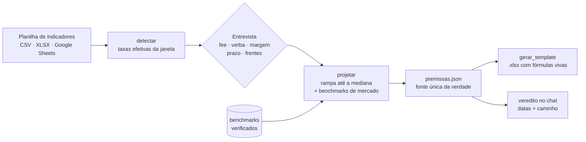

# Projeção de breakeven

**Da planilha de indicadores do cliente para uma projeção de breakeven defensável — com veredito de realismo, benchmarks verificados e um .xlsx pronto para apresentar.**


Esta é uma **skill do [Claude Code](https://claude.com/claude-code)**: você aponta para a planilha mensal de indicadores de um cliente, responde a uma entrevista curta (fee, verba, margem, prazo) e recebe de volta o veredito — *este cliente se paga em que mês?* — mais uma planilha completa, com fórmulas vivas, cenários e a aba de premissas que explica cada número.

Funciona sozinha no terminal também: o piloto e o gerador são dois scripts em Python puro.

---

## Índice

- [O problema](#o-problema)
- [O que a skill faz](#o-que-a-skill-faz)
- [Exemplo em 2 minutos](#exemplo-em-2-minutos)
- [Como funciona](#como-funciona)
- [Instalação](#instalação)
- [A entrevista](#a-entrevista)
- [Regras de modelagem](#regras-de-modelagem)
- [Anatomia da planilha](#anatomia-da-planilha)
- [Referência dos comandos](#referência-dos-comandos)
- [Benchmarks e fontes](#benchmarks-e-fontes)
- [Estrutura do projeto](#estrutura-do-projeto)
- [Testes](#testes)
- [Roadmap](#roadmap)
- [Contribuindo](#contribuindo)
- [Licença](#licença)

---

## O problema

Toda agência responde a mesma pergunta: **"em que mês esse cliente começa a se pagar?"**

Na prática, a resposta costuma sair de uma planilha montada às pressas, com taxas do melhor mês, metas otimistas e nenhuma fonte. Quando o cliente pergunta "de onde veio esse 30% de conversão?", não há resposta.

Esta skill existe para que a resposta seja sempre a mesma: **do histórico do cliente, ou de um benchmark que dá para abrir e conferir.**

## O que a skill faz

- **Lê a planilha de indicadores** (padrão Growth Pack, mensal) em CSV, XLSX ou Google Sheets, e calcula as taxas efetivas de cada etapa do funil, ponderadas por volume.
- **Dá o veredito de realismo** — REALISTA, REALISTA COM RAMPA ou IRREALISTA — com duas datas que o cliente entende: **no azul a partir de** (o mês em que o resultado passa a ser positivo e continua) e **acumulado zera em** (o payback).
- **Nunca entrega só "irrealista".** Quando a meta não fecha, calcula o caminho: quanto cada alavanca precisaria sozinha, que fee fecharia, que verba cobriria o fee, e em que mês o breakeven fica realista.
- **Projeta com rampa até a mediana** do período comparável, nunca até o melhor mês — com base pequena, o melhor mês infla a projeção.
- **Modela as frentes contratadas:** mídia paga, SEO e tráfego orgânico, CRM (recompra, cross-sell, reativação por coorte), remarketing e sazonalidade do produto.
- **Exige fonte para toda premissa que não vem do histórico.** Os benchmarks ficam em JSON, com fonte, período, número encontrado, taxa usada e justificativa — e vão para a planilha, com link.
- **Gera o .xlsx** com fórmulas vivas (o cliente mexe nas células amarelas e tudo recalcula), cenários em abas paralelas, gráficos e a aba de premissas.

## Exemplo em 2 minutos

O repositório traz dados sintéticos em `tests/fixtures/`. Nada aqui é de cliente real.

```bash
# 1) o que existe na fonte: meses fechados, fee, verba, margem e taxas efetivas
python3 scripts/breakeven_pilot.py detectar \
  --fonte tests/fixtures/indicadores_inside_sales.csv --modelo inside_sales

# 2) o veredito, com as premissas confirmadas
python3 scripts/breakeven_pilot.py projetar \
  --fonte tests/fixtures/indicadores_inside_sales.csv --modelo inside_sales \
  --fee 1200 --midia 5000 --margem 0.30 --comissao 1 \
  --mes-alvo 3 --horizonte 4 --crescimento-midia 0.05 \
  --out premissas.json

# 3) a planilha do cliente
python3 scripts/gerar_template.py --premissas premissas.json \
  --modelo inside_sales --cliente "Cliente Demo" --out projecao.xlsx
```

O passo 2 responde assim:

```json
{
  "status": "IRREALISTA",
  "mes_alvo": 3,
  "vendas_projetadas_mes_alvo": 3.4,
  "vendas_necessarias_mes_alvo": 25,
  "no_azul_continuo_desde": null,
  "acumulado_zera_em": null,
  "mes_referencia": "janeiro/2026"
}
```

E, junto, o caminho: o que cada alavanca teria de entregar para o mês-alvo fechar no zero, o fee que fecharia e a verba que cobriria o fee. É isso que vira conversa com o cliente.

Sem argumentos, o gerador monta uma planilha de demonstração com os dois modelos:

```bash
python3 gerador/build_workbook.py demo.xlsx
```

## Como funciona



O `premissas.json` é a fonte única: o veredito, a curva mês a mês, o envelope histórico, os alertas e o caminho. O gerador só lê esse arquivo — o que aparece na planilha é sempre o que o piloto calculou.

## Instalação

Requisitos: Python 3.9 ou mais novo.

```bash
git clone https://github.com/jeanreisv4/growth-enginner.git
cd v4-projecao-breakeven
python3 -m pip install --user pandas openpyxl pycel
python3 tests/regressao.py     # 11 casos, incluindo a demo
```

**Como skill do Claude Code**, copie a pasta para `~/.claude/skills/projecao-breakeven/` (ou para `.claude/skills/` do projeto). O arquivo `SKILL.md` é o que o Claude lê: ele conduz a entrevista, roda o piloto, dá o veredito e preenche o template sozinho.

Opcionais:

- **Google Sheets:** passe a URL da planilha; o `gid` da URL vira a aba. Planilha privada precisa de um conector com acesso ao Drive.
- **GA4:** com o servidor MCP `analytics-mcp` configurado, `scripts/ga4_resumo.py` gera o recorte mensal e o piloto separa Google e Meta no funil de e-commerce.
- **Logo:** coloque um PNG em `gerador/logo.png` e ele aparece no canto da planilha. Sem o arquivo, a planilha sai sem logo. O rodapé aceita `--marca "Sua Agência"`.

## A entrevista

A skill não espera você lembrar o que informar. Ela pergunta, nesta ordem:

| # | Pergunta | Por que muda o resultado |
|---|---|---|
| 1.0 | Quais frentes estão contratadas (mídia, SEO, CRM, social, remarketing, comercial) e o que o fee cobre | Cada frente acrescenta um bloco à projeção |
| 1.1 | Qual é a fonte da verdade | Nada entra na projeção sem estar na fonte |
| 1.2 | Qual modelo: inside sales ou e-commerce | Define a cadeia do funil |
| 1.3 | Fee e plano de verba, confirmados | Projeção com valor não confirmado não vale |
| 1.3.1 | Custo de mídia da campanha **atual**; o CPM sobe com a escala?; fatia de remarketing; eleição e datas no horizonte | Média com meses de outro objetivo distorce o custo por lead |
| 1.4 | Margem de contribuição, **confirmada em reais numa venda concreta** | "20%" pode ser sobre o valor cheio ou sobre a comissão — e isso troca o veredito |
| 1.5 | Mês-alvo e se o déficit histórico entra no acumulado | Define o que é "bater a meta" |
| 1.5.1 | Existe prazo do cliente? | Se o plano realista não fecha no prazo, o cenário-meta vai em aba separada |
| 1.5.2 | Quantos contatos e vendas por mês a operação aguenta | A projeção define volumes; a equipe precisa caber neles |
| 1.6 | Desde quando o histórico é comparável | Mudança de oferta ou de campanha reinicia a comparação |
| 1.6.3 | Sazonalidade do produto e ofertas de datas | Medida no Google Trends do termo exato, não no varejo em geral |

## Regras de modelagem

Estas são as regras que a skill não quebra:

- **Taxas atuais** = média ponderada por volume do último quarter fechado. O mês corrente parcial só entra se você pedir.
- **Alvo da rampa** = mediana do período comparável, nunca o melhor mês, e nunca pior que a taxa atual.
- **Nenhuma taxa de etapa passa de 100%.** Se passar, o denominador está subcontado na fonte, e isso é dito.
- **Etapa com amostra pequena** (menos de 30 eventos na origem ou 10 no destino) vira hipótese sinalizada.
- **Meses já vividos entram pelo realizado**, não pela projeção — inclusive no veredito e no payback.
- **O funil corre só sobre o tráfego pago.** Sessões ou visitas orgânicas aparecem como contexto.
- **Premissa sem histórico precisa de benchmark verificado**, aberto na página da fonte. Sem fonte primária, não entra; segmento aproximado é dito como aproximação.
- **Modelo padrão de dados:** a aba de projeção mostra a cadeia padrão com o valor usado no mês. Premissa que varia (CPM com saturação, multiplicadores de datas, sazonalidade) não vira linha na projeção — a decomposição vai para a aba de premissas, em tabela mês a mês.
- **Nunca só "irrealista".** Sempre com o mês em que fica realista e o que teria de mudar.

## Anatomia da planilha

Cada projeção vira uma aba, e cada aba tem a sua aba de premissas.

**Aba do cliente**

1. **Premissas** (amarelo é editável): fee, verba, margem, comissão, lag, acumulado inicial.
2. **Resultado executivo**: cartões com faturamento, vendas, custo, resultado, payback, exposição de caixa e "no azul a partir de".
3. **Meta de breakeven**: vendas necessárias contra projetadas, por fórmula, com a coluna PILOTO ao lado para conferência.
4. **Projeção mês a mês**: cada mês com par Projetado | Realizado; linhas calculadas mesclam o par.
5. **Gráficos**: faturamento e crescimento, resultado acumulado (com a linha de cada cenário), curva de payback e funil.

**Aba de premissas**

Veredito e leitura, caminho para o breakeven, fonte e janela, curva da projeção, alertas de amostra, premissas assumidas, análise de mercado, a tabela **Premissa | Fonte | Benchmark | Período | Taxa utilizada | Justificativa**, os benchmarks pesquisados e descartados, o histórico lido da fonte, o envelope da rampa e as fontes com link.

## Referência dos comandos

### `breakeven_pilot.py detectar`

Lê a fonte e mostra meses fechados, fee, verba, margem e as taxas efetivas da janela.

### `breakeven_pilot.py projetar`

| Flag | Para quê |
|---|---|
| `--fonte` `--aba` `--modelo` | fonte de dados e modelo (`inside_sales` ou `ecommerce`) |
| `--fee` `--midia` `--margem` `--comissao` | premissas confirmadas na entrevista |
| `--mes-alvo` `--horizonte` `--rampa-ate` | meta, tamanho da projeção e fim da rampa |
| `--verba-plano` / `--crescimento-midia` `--midia-teto` | verba em degraus ou crescimento com teto |
| `--fee-plano` `--fee-historico` | fee que muda no meio (ex.: CRM entra) ou fee de contrato diferente da fonte |
| `--acumulado-inicial` `--inicio` `--desde` `--janela` `--incluir-corrente` | déficit histórico, Mês 1, período comparável e janela de taxas |
| `--fixar alavanca=valor` | trava uma etapa (campanha mudou no meio da janela) |
| `--alvo alavanca=valor` | alvo da rampa vindo de benchmark de mercado (inclusive `conexao=0.69`) |
| `--sazonalidade-demanda` `--sazonalidade-cpm` | multiplicadores mês a mês (Black Friday, Natal, eleição, datas) |
| `--cpm-crescimento` `--cpm-teto` `--cpm-crescimento-ate` | CPM subindo com a saturação do público |
| `--organico-visitas` `--organico-conversao` | SEO: visitas orgânicas viram leads |
| `--crm crm.json` | recompra, cross-sell e reativação da base, por coorte |
| `--ga4 ga4.json` | separa Google e Meta no e-commerce |

### `gerar_template.py`

| Flag | Para quê |
|---|---|
| `--premissas` `--modelo` `--cliente` `--out` | entrada, modelo, nome do cliente e arquivo de saída |
| `--extra "premissas.json\|Aba\|Cenário\|metodologia.json"` | cenário extra em outra aba, com a própria aba de premissas |
| `--metodologia-extra` | seções de análise e a tabela de benchmarks |
| `--inicio-contrato` `--obs` `--marca` | Mês 1, observações e marca no rodapé |
| `--conexao-so-lead` `--sem-etapa-venda` `--margem-informativa` | variações do funil conforme o que o cliente mede |
| `--legado arquivo.json` | bloco **projetado × realizado** na aba Premissas: o que uma projeção anterior prometia, mês a mês, contra o realizado da fonte, com a linha de atingimento |

## Benchmarks e fontes

Quando o histórico é curto demais, a premissa vem de fora — e vem com endereço. O repositório traz dois conjuntos verificados, que servem de modelo para montar o seu:

- `referencias/crm_turismo_benchmarks.json` — recompra, cross-sell, reativação, e-mail e descadastro para CRM de turismo (15 fontes).
- `referencias/multimidia_automotiva_benchmarks.json` — funil de lead ads, taxa de contato, conversão de SQL, CPM no Brasil, eleição, remarketing, sazonalidade e margem do varejo de acessórios (42 fontes).

O formato é sempre o mesmo: `colunas`, `linhas` (premissa, fonte, benchmark encontrado, período, taxa utilizada, justificativa), `descartados` e `fontes` com link. `scripts/metodologia_mercado.py` transforma isso nas seções da aba de premissas.

**A regra:** número que só aparece em blog agregador, sem fonte primária aberta, vai para "descartados" — e o motivo fica escrito na planilha.

## Estrutura do projeto

```
.
├── SKILL.md                  # o que o Claude Code lê: entrevista, regras e passo a passo
├── CHANGELOG.md              # o que mudou em cada versão, e por quê
├── scripts/
│   ├── breakeven_pilot.py    # taxas efetivas, veredito, caminho, curva mês a mês
│   ├── gerar_template.py     # atalho para o gerador
│   ├── metodologia_crm.py    # seções de CRM da aba de premissas
│   ├── metodologia_mercado.py# seções de mercado da aba de premissas
│   └── ga4_resumo.py         # recorte mensal do GA4 (opcional)
├── gerador/
│   ├── build_workbook.py     # monta o .xlsx a partir do premissas.json
│   └── projecao_builder.py   # layout, fórmulas, gráficos e abas
├── referencias/
│   ├── inside_sales.md       # armadilhas e casos reais (anonimizados)
│   ├── ecommerce.md
│   └── *_benchmarks.json     # benchmarks verificados
└── tests/
    ├── regressao.py          # 11 casos, com recálculo das fórmulas
    └── fixtures/             # dados sintéticos
```

## Testes

```bash
python3 tests/regressao.py
```

Para cada caso, o teste roda o piloto, gera a planilha, **recalcula todas as fórmulas com o `pycel`** e confere: receita do template igual à do piloto mês a mês, nenhuma taxa acima de 100%, nenhuma fórmula com erro, nenhuma célula azul (azul é reservado) e as seções obrigatórias da aba de premissas.

Rode sempre depois de mexer em `scripts/` ou `gerador/`.

## Roadmap

- [ ] Modelo para e-commerce com CRM (hoje o CRM é só inside sales)
- [ ] Conectores de mídia (Meta e Google Ads) para o custo vir direto da conta
- [ ] Exportar a projeção direto para Google Sheets
- [ ] Mais conjuntos de benchmark por setor
- [ ] Versão em inglês do `SKILL.md`

## Contribuindo

Issues e PRs são bem-vindos. Antes de abrir PR:

1. Rode `python3 tests/regressao.py` (os 11 casos precisam passar).
2. Se mudou o que o cliente vê, acrescente uma entrada no `CHANGELOG.md` explicando **por que** mudou.
3. Premissa nova só entra com fonte primária aberta — ou marcada como premissa do usuário, com essa palavra.

## Licença

[MIT](LICENSE).

---

<sub>Os casos citados em `referencias/` são reais, mas anonimizados: nomes, fees e faturamentos foram trocados ou arredondados. Os dados em `tests/fixtures/` são sintéticos.</sub>
