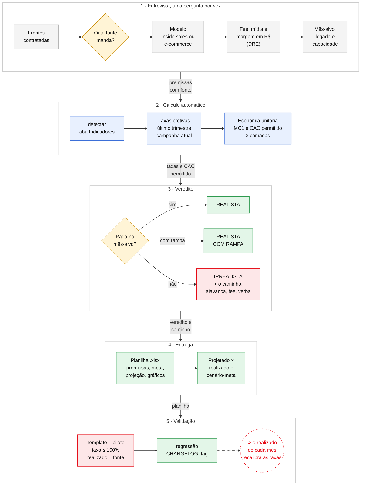

# projecao-breakeven

 

Skill do Claude Code que responde **em que mês o projeto se paga**. Lê o histórico do cliente (planilha padrão
V4, CRM, export de mídia, GA4), conduz a entrevista das premissas, calcula as taxas efetivas, dá o veredito de
realismo e entrega a planilha .xlsx de projeção pronta para apresentar, com projetado × realizado.

## Workflow

```mermaid
flowchart TB
    classDef entrada fill:#F4F4F4,stroke:#8A8A8A,color:#111
    classDef decisao fill:#FFF4D6,stroke:#C98A00,color:#111
    classDef calculo fill:#E8F0FE,stroke:#3B6FD8,color:#111
    classDef saida fill:#E3F6E8,stroke:#2E9A4F,color:#111
    classDef trava fill:#FDE7E8,stroke:#E50914,color:#111
    classDef loop fill:#FFFFFF,stroke:#E50914,stroke-dasharray:4 3,color:#E50914

    subgraph E["1 · Entrevista, uma pergunta por vez"]
        direction LR
        E1["Frentes<br/>contratadas"]:::entrada --> E2{"Qual fonte<br/>manda?"}:::decisao --> E3["Modelo<br/>inside sales ou<br/>e-commerce"]:::entrada --> E4["Fee, mídia e<br/>margem em R$<br/>(DRE)"]:::entrada --> E5["Mês-alvo,<br/>legado e<br/>capacidade"]:::entrada
    end

    subgraph C["2 · Cálculo automático"]
        direction LR
        C1["detectar<br/>aba Indicadores"]:::calculo --> C2["Taxas efetivas<br/>último trimestre<br/>campanha atual"]:::calculo --> C3["Economia unitária<br/>MC1 e CAC permitido<br/>3 camadas"]:::calculo
    end

    subgraph V["3 · Veredito"]
        direction LR
        V1{"Paga no<br/>mês-alvo?"}:::decisao
        V1 -->|sim| V2["REALISTA"]:::saida
        V1 -->|com rampa| V3["REALISTA<br/>COM RAMPA"]:::saida
        V1 -->|não| V4["IRREALISTA<br/>+ o caminho:<br/>alavanca, fee, verba"]:::trava
    end

    subgraph T["4 · Entrega"]
        direction LR
        T1["Planilha .xlsx<br/>premissas, meta,<br/>projeção, gráficos"]:::saida --> T2["Projetado ×<br/>realizado e<br/>cenário-meta"]:::saida
    end

    subgraph Q["5 · Validação"]
        direction LR
        Q1["Template = piloto<br/>taxa ≤ 100%<br/>realizado = fonte"]:::trava --> Q2["regressão<br/>CHANGELOG, tag"]:::saida
        Q2 -.-> Q3(("↺ o realizado<br/>de cada mês<br/>recalibra as taxas")):::loop
    end

    E -->|"premissas<br/>com fonte"| C
    C -->|"taxas e CAC<br/>permitido"| V
    V -->|"veredito e<br/>caminho"| T
    T -->|"planilha"| Q
    style E fill:#FFFFFF,stroke:#CCCCCC
    style C fill:#FFFFFF,stroke:#CCCCCC
    style V fill:#FFFFFF,stroke:#CCCCCC
    style T fill:#FFFFFF,stroke:#CCCCCC
    style Q fill:#FFFFFF,stroke:#CCCCCC
```

Legenda: cinza = informação do usuário · amarelo = decisão · azul = cálculo automático · verde = entrega ·
vermelho = trava ou alerta · ↺ = onde o loop se fecha. Na seta entre as fases, a saída de cada uma.

## O que a skill nunca faz

- Somar número de duas fontes para o mesmo mês.
- Inventar connect rate, ticket ou margem que não vieram da fonte ou do usuário.
- Entregar só "IRREALISTA": quando a meta não fecha, mostra o caminho (o que precisa ser verdade em cada alavanca).

## Estrutura

- `SKILL.md`: entrevista, regras de cálculo, veredito, template, validação.
- `referencias/`: `inside_sales.md`, `ecommerce.md` e benchmarks por setor (JSON, com fonte).
- `scripts/`: `breakeven_pilot.py` (detectar e projetar), `gerar_template.py`, `ga4_resumo.py`,
  `metodologia_crm.py`, `metodologia_mercado.py`.
- `gerador/`: montagem da planilha (`build_workbook.py`, `projecao_builder.py`).
- `tests/regressao.py` + `tests/fixtures/` (dados sintéticos).

Parte do [growth-enginner](../README.md). Dados de cliente nunca entram neste repositório.
