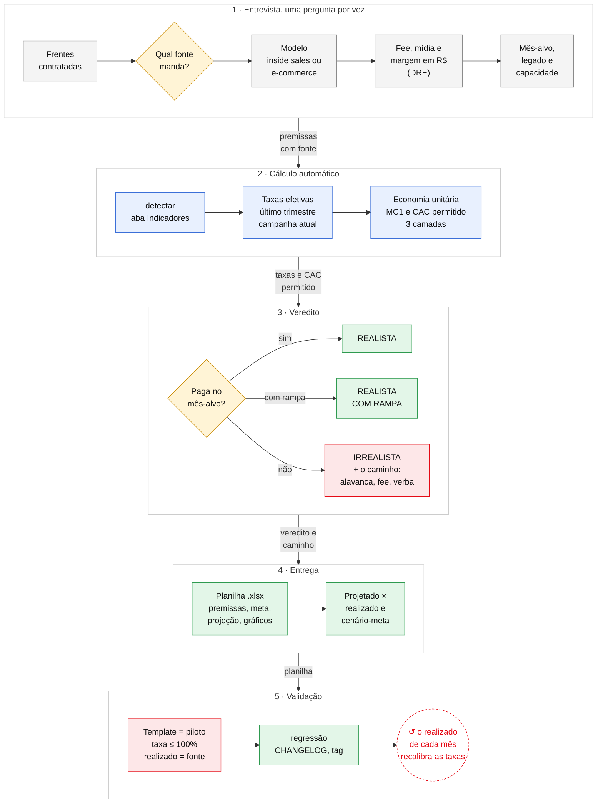

# projecao-breakeven

 

Skill do Claude Code que responde **em que mês o projeto se paga**. Lê o histórico do cliente (planilha padrão
V4, CRM, export de mídia, GA4), conduz a entrevista das premissas, calcula as taxas efetivas, dá o veredito de
realismo e entrega a planilha .xlsx de projeção pronta para apresentar, com projetado × realizado.

## Workflow

Ver o desenho detalhado (fases, decisões e travas)

```mermaid
flowchart TB
    classDef entrada fill:#F4F4F4,stroke:#8A8A8A,color:#111
    classDef decisao fill:#FFF4D6,stroke:#C98A00,color:#111
    classDef calculo fill:#E8F0FE,stroke:#3B6FD8,color:#111
    classDef saida fill:#E3F6E8,stroke:#2E9A4F,color:#111
    classDef trava fill:#FDE7E8,stroke:#E50914,color:#111
    classDef loop fill:#FFFFFF,stroke:#E50914,stroke-dasharray:4 3,color:#E50914

    subgraph E["1 · Entrevista, uma pergunta por vez"]
        direction LR
        E1["Frentes<br/>contratadas"]:::entrada --> E2{"Qual fonte<br/>manda?"}:::decisao --> E3["Modelo<br/>inside sales ou<br/>e-commerce"]:::entrada --> E4["Fee, mídia e<br/>margem em R$<br/>(DRE)"]:::entrada --> E5["Mês-alvo,<br/>legado e<br/>capacidade"]:::entrada
    end

    subgraph C["2 · Cálculo automático"]
        direction LR
        C1["detectar<br/>aba Indicadores"]:::calculo --> C2["Taxas efetivas<br/>último trimestre<br/>campanha atual"]:::calculo --> C3["Economia unitária<br/>MC1 e CAC permitido<br/>3 camadas"]:::calculo
    end

    subgraph V["3 · Veredito"]
        direction LR
        V1{"Paga no<br/>mês-alvo?"}:::decisao
        V1 -->|sim| V2["REALISTA"]:::saida
        V1 -->|com rampa| V3["REALISTA<br/>COM RAMPA"]:::saida
        V1 -->|não| V4["IRREALISTA<br/>+ o caminho:<br/>alavanca, fee, verba"]:::trava
    end

    subgraph T["4 · Entrega"]
        direction LR
        T1["Planilha .xlsx<br/>premissas, meta,<br/>projeção, gráficos"]:::saida --> T2["Projetado ×<br/>realizado e<br/>cenário-meta"]:::saida
    end

    subgraph Q["5 · Validação"]
        direction LR
        Q1["Template = piloto<br/>taxa ≤ 100%<br/>realizado = fonte"]:::trava --> Q2["regressão<br/>CHANGELOG, tag"]:::saida
        Q2 -.-> Q3(("↺ o realizado<br/>de cada mês<br/>recalibra as taxas")):::loop
    end

    E -->|"premissas<br/>com fonte"| C
    C -->|"taxas e CAC<br/>permitido"| V
    V -->|"veredito e<br/>caminho"| T
    T -->|"planilha"| Q
    style E fill:#FFFFFF,stroke:#CCCCCC
    style C fill:#FFFFFF,stroke:#CCCCCC
    style V fill:#FFFFFF,stroke:#CCCCCC
    style T fill:#FFFFFF,stroke:#CCCCCC
    style Q fill:#FFFFFF,stroke:#CCCCCC
```

Legenda: cinza = informação do usuário · amarelo = decisão · azul = cálculo automático · verde = entrega ·
vermelho = trava ou alerta · ↺ = onde o loop se fecha. Na seta entre as fases, a saída de cada uma.

## A cadeia que a planilha calcula

## Como funciona

Uma linha por etapa do desenho. "Trava" é o que impede a etapa seguinte; o detalhe de cada pergunta e de cada
regra de cálculo está no [SKILL.md](SKILL.md).

| Fase | Entra | O que a skill faz | Ferramenta | Sai | Trava |
|---|---|---|---|---|---|
| **1 · Fonte** | Planilha padrão V4, export do CRM ou de mídia, GA4 | Pergunta **qual fonte manda** e o que não é fonte; como a venda é contada (manual ou CRM, criação ou fechamento, com ou sem recompra) | [`ga4_resumo.py`](scripts/ga4_resumo.py) (com GA4) | Uma fonte só, registrada nas observações | Duas fontes para o mesmo mês: nunca somar |
| **1 · Modelo, fee e verba** | A fonte | Detecta meses fechados, fee, verba e margem; pede confirmação explícita; plano de verba em degraus | [`breakeven_pilot.py detectar`](scripts/breakeven_pilot.py) | Fee e verba confirmados; modelo inside sales, e-commerce ou PLG | Sem fee e verba confirmados, não projeta |
| **1 · Margem** | DRE ou uma venda concreta | Pergunta a margem **em reais** ("numa venda de R$ 22 mil, quanto sobra?"), comissão ou receita própria | — | MC1 | Percentual solto não é aceito |
| **1 · Horizonte e metas** | Usuário | Mês-alvo, déficit acumulado, legado dentro da tabela, projeção anterior, prazo do cliente, capacidade do time, período comparável | — | Premissas de tempo e capacidade | — |
| **1 · Frentes extras** | Contrato | Orgânico (origem e curva), CRM (base por recência, benchmarks com fonte), histórico curto (alvos de mercado), sazonalidade medida no Google Trends | [`metodologia_crm.py`](scripts/metodologia_crm.py), [`metodologia_mercado.py`](scripts/metodologia_mercado.py), `referencias/*_benchmarks.json` | Blocos extras e tabela de premissas com fonte | Número sem fonte primária não entra |
| **2 · Cálculo** | Premissas confirmadas | Taxas do último trimestre fechado, custo de mídia da campanha atual, nenhuma taxa acima de 100%, amostra frágil sinalizada | [`breakeven_pilot.py projetar`](scripts/breakeven_pilot.py) | `premissas.json` | Taxa > 100% sem causa explicada |
| **2 · Economia unitária** | MC1, ticket, fee, verba | CAC permitido = MC1 × ticket; ROAS de breakeven nas 3 camadas (transação, contrato, empresa); trava contra o melhor mês real (1,2x) | Piloto | Folga de aquisição, alerta de promessa acima do histórico | — |
| **3 · Veredito** | `premissas.json` | REALISTA, REALISTA COM RAMPA (qual fração) ou IRREALISTA com o caminho: o valor de cada alavanca que fecha a meta, o fee que fecharia, a verba que cobre o fee | Piloto | Duas datas: "no azul a partir de" e "acumulado zera em" | Nunca só "irrealista" |
| **4 · Entrega** | Veredito aceito | Preenche o template: premissas, resultado, meta, projeção mês a mês (Projetado \| Realizado), gráficos; cenário-meta em aba extra | [`gerar_template.py`](scripts/gerar_template.py) → [`build_workbook.py`](gerador/build_workbook.py) | Planilha .xlsx com fórmulas vivas | Template antes do veredito |
| **5 · Validação** | A planilha | Recalcula as fórmulas e confere receita = piloto, taxa ≤ 100%, realizado = fonte, sem erro nem azul | pycel + [`tests/regressao.py`](tests/regressao.py) | Planilha conferida, CHANGELOG, tag | Qualquer divergência |
| **↺ Mês seguinte** | Realizado do mês | O realizado entra na coluna Realizado e recalibra as taxas da próxima projeção | — | Projeção de acompanhamento | — |

## O que a skill nunca faz

- Somar número de duas fontes para o mesmo mês.
- Inventar connect rate, ticket ou margem que não vieram da fonte ou do usuário.
- Entregar só "IRREALISTA": quando a meta não fecha, mostra o caminho (o que precisa ser verdade em cada alavanca).

## Estrutura

- `SKILL.md`: entrevista, regras de cálculo, veredito, template, validação.
- `referencias/`: `inside_sales.md`, `ecommerce.md` e benchmarks por setor (JSON, com fonte).
- `scripts/`: `breakeven_pilot.py` (detectar e projetar), `gerar_template.py`, `ga4_resumo.py`,
  `metodologia_crm.py`, `metodologia_mercado.py`.
- `scripts/desenhos.py`: gera os desenhos animados de `assets/`.
- `gerador/`: montagem da planilha (`build_workbook.py`, `projecao_builder.py`).
- `tests/regressao.py` + `tests/fixtures/` (dados sintéticos).

Parte do [growth-enginner](../README.md). Dados de cliente nunca entram neste repositório.
