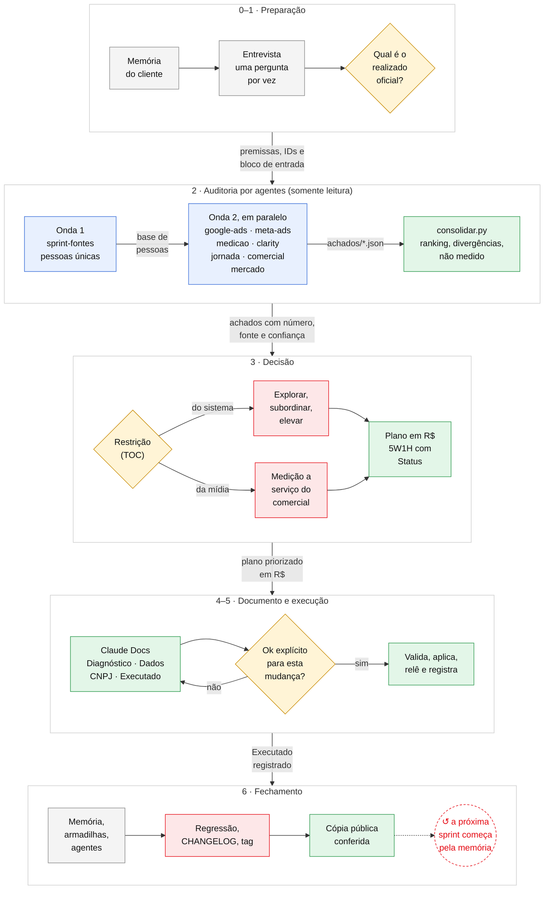

# sprint-growth

  

Skill do Claude Code para a **sprint growth** de cliente de agência: audita a jornada inteira, do tráfego à venda,
acha a restrição do sistema pela Teoria das Restrições e entrega um plano 5W1H priorizado por impacto em receita,
com as correções executadas pelas MCPs (Google Ads, GTM, GA4) e registradas numa aba "Executado".

A partir da v2.0, a auditoria roda em **oito agentes especialistas**, um por frente, cada um com o próprio
contexto e somente leitura. A conversa principal entrevista, decide, escreve o documento e executa com o ok do
usuário. O desenho segue o do [claude-seo](../claude-seo/): uma skill que orquestra, agentes que auditam em
paralelo e um contrato de saída que um script consolida.

- Mídia: Google Ads pela API (conversões, invasão, lances, qualidade, parcela, sitelinks, destinos, termos e
  negativas) e Meta pelo conector ou export (criativo × qualidade do lead, inclusive CNPJ na Receita).
- Medição: GTM web e servidor contra as conversões da conta, disparo real das tags, formulário interceptado (sem
  criar lead), GA4, Pixel/CAPI e a origem do anúncio até o CRM.
- Comportamento: Microsoft Clarity (robôs, cliques de raiva e mortos, volta rápida, erro de script, rolagem).
- Jornada e comercial: destino, on-page, CRM (DataCrazy pela API), lead novo × cliente antigo, perdas, tempos.
- Receita: realizado da fonte oficial, CPL real por pessoa única, breakeven pela skill `projecao-breakeven`.

## Workflow

Ver o desenho detalhado (fases, decisões e travas)

Legenda: cinza = informação ou registro · amarelo = decisão · azul = análise · verde = entrega ·
vermelho = trava ou prioridade · ↺ = onde o loop se fecha. Na seta entre as fases, a saída de cada uma.

## Modos: auditoria e correção

A sprint tem dois modos sobre o mesmo catálogo. Cada plataforma tem um arquivo com **tudo o que se verifica**
(tabela Auditoria: o que olhar, qual agente, como, o sinal de problema e a gravidade) e **tudo o que se corrige**
(tabela Correção: o que corrige, como aplicar, o que validar antes, o risco, como voltar atrás e como conferir
depois). Todo item de auditoria tem pelo menos uma correção; [`catalogo.py`](scripts/catalogo.py) e a regressão
conferem.

- **Auditoria**: somente leitura, pelos agentes. Cada frente devolve o status de **cada** item seu (ok, achado, não
  medido, não se aplica) e o consolidado mostra o que ficou sem verificar.
- **Correção**: executa um `CX-…` do plano ou de uma ordem direta ("corrige o A2 do cliente X"). Ciclo em
  [`modos.md`](referencias/modos.md): preparar, validar antes, mostrar, ok explícito, aplicar, reler, registrar,
  monitorar. Risco **R1** (reversível na hora), **R2** (configuração com volta guardada) e **R3** (mexe no
  aprendizado da plataforma: ok à parte).

| Plataforma | Itens de auditoria | Correções | Críticos e altos |
| --- | --- | --- | --- |
| [`clarity.md`](referencias/plataformas/clarity.md) | 8 | 7 | 3 |
| [`comercial.md`](referencias/plataformas/comercial.md) | 10 | 10 | 5 |
| [`crm_integracao.md`](referencias/plataformas/crm_integracao.md) | 11 | 11 | 6 |
| [`fontes.md`](referencias/plataformas/fontes.md) | 8 | 5 | 6 |
| [`ga4.md`](referencias/plataformas/ga4.md) | 13 | 13 | 6 |
| [`google_ads.md`](referencias/plataformas/google_ads.md) | 28 | 19 | 10 |
| [`gtm.md`](referencias/plataformas/gtm.md) | 18 | 15 | 13 |
| [`mercado.md`](referencias/plataformas/mercado.md) | 5 | 2 | 0 |
| [`meta_ads.md`](referencias/plataformas/meta_ads.md) | 18 | 14 | 8 |
| [`paginas.md`](referencias/plataformas/paginas.md) | 12 | 12 | 5 |
| **Total** | **131** | **108** | **62** |

## Como funciona

Uma linha por fase do desenho e uma por agente. "Trava" é o que impede a fase seguinte; o roteiro completo está
no [SKILL.md](SKILL.md), cada frente no seu arquivo em [agentes/](agentes/) e as armadilhas em
[referencias/armadilhas.md](referencias/armadilhas.md).

| Fase | Entra | O que a skill faz | Ferramenta | Sai | Trava |
|---|---|---|---|---|---|
| **0 · Memória** | `clientes/<c>/memoria.md`, se existir | Lê inteira antes de perguntar; senão copia o modelo de cliente | [`templates/cliente/`](templates/cliente/) | IDs, premissas, regra de atribuição, o que foi executado | — |
| **1 · Entrevista** | Usuário, uma pergunta por vez | Modelo de negócio, fee, verba, margem pelo DRE, meta, realizado oficial, como a venda é contada, atribuição da V4 | — | Premissas na memória e o bloco de entrada dos agentes | Sem realizado oficial, nenhum gráfico |
| **2 · Agentes** | Bloco de entrada | Onda 1 (fontes) e onda 2 (as frentes que se aplicam, em paralelo); cada agente grava `achados/<frente>.json` + `.md` | [`instalar_agentes.py`](scripts/instalar_agentes.py), [`contrato_achados.md`](referencias/contrato_achados.md) | Achados com número, fonte, confiança e correção proposta | Agente não fala com o usuário: o que falta vem em `perguntas` |
| **2 · Consolidação** | `achados/*.json` | Confere o contrato, mostra a cobertura do catálogo por frente, ordena (segurança e medição primeiro, depois R$), aponta a mesma métrica divergindo entre frentes | [`consolidar.py`](scripts/consolidar.py) | `consolidado.md` e `.json` | Arquivo recusado volta ao agente; item crítico ou alto sem status; divergência vira pergunta de qual fonte manda |
| **3 · Decisão** | Consolidado | Restrição pela TOC (do sistema ou da mídia); impacto em R$ × confiança × esforço; os 2 maiores achados conferidos à mão | [`priorizacao.md`](referencias/priorizacao.md) | Plano 5W1H com Status | — |
| **4 · Documento** | Tudo acima | Claude Docs: Diagnóstico e plano, Dados do funil, Leads por CNPJ, Executado | [`documento.md`](referencias/documento.md) | Documento para o time e o cliente | Gráfico com título que não bate com o número |
| **5 · Correção** | Linha do plano com o `CX-…` | Prepara, valida antes (validateOnly, rascunho do GTM, backup do fluxo), mostra risco e volta, aplica com ok, relê e registra | [`modos.md`](referencias/modos.md), tabela Correção da plataforma, [`ads_escrita.py`](scripts/ads_escrita.py), MCPs | Linha na aba Executado, com o valor anterior | Sem ok explícito para aquela mudança, nada muda; R3 pede ok à parte |
| **↺ 6 · Fechamento** | O que a sprint ensinou | Memória, armadilhas, catálogo (item e correção novos), agentes, regressão, CHANGELOG, tag, cópia pública conferida | [`regressao.py`](tests/regressao.py) | Nova versão | Regressão falhando |

| Agente (onda) | Entra | O que faz | Ferramenta | Sai |
|---|---|---|---|---|
| [`sprint-fontes`](agentes/sprint-fontes.md) (1) | Backup de leads, planilhas, realizado oficial | Período e confiabilidade de cada base; pessoa única sem teste; canal; CNPJ | [`leads.py`](scripts/leads.py), [`cnpj.py`](scripts/cnpj.py) | `base/pessoas.json`, `leads_*` por pessoa |
| [`sprint-google-ads`](agentes/sprint-google-ads.md) (2) | Conta e MCC | Alertas A1–A10, termos e negativas, anúncio × página, CPL real | [`ads_auditoria.py`](scripts/ads_auditoria.py), [`termos_negativas.py`](scripts/termos_negativas.py), MCP Google Ads | Achados `ADS-`, negativas propostas |
| [`sprint-meta-ads`](agentes/sprint-meta-ads.md) (2) | Conta ou export | Criativo × qualidade do lead, segunda conta, anomalias, CPL real | Conector Meta Ads (leitura) | Achados `META-` |
| [`sprint-medicao`](agentes/sprint-medicao.md) (2) | GTM, GA4, Ads, conjunto de dados, LPs | G1–G5, disparo real, formulário interceptado, GA4, Pixel/CAPI, lead até o CRM | [`gtm_auditoria.py`](scripts/gtm_auditoria.py), [`teste_disparo.py`](scripts/teste_disparo.py), [`teste_formulario.py`](scripts/teste_formulario.py), skill `tracking-web-and-capi` | Achados `MED-` |
| [`sprint-clarity`](agentes/sprint-clarity.md) (2) | Token do projeto | Coleta diária econômica; alertas C1–C6 nas páginas de mídia | [`clarity.py`](scripts/clarity.py) | Achados `CLA-` |
| [`sprint-jornada`](agentes/sprint-jornada.md) (2) | Site, LPs, destinos | Custo por destino, oferta × página, on-page, SEO técnico básico, velocidade | render do claude-seo, GA4 | Achados `JOR-`, caminhos do lead |
| [`sprint-comercial`](agentes/sprint-comercial.md) (2) | CRM ou export | Novo × antigo, funil por etapa, perdas, tempos, follow-up, receita (piso) | [`datacrazy.py`](scripts/datacrazy.py) | Achados `COM-`, dados do funil |
| [`sprint-mercado`](agentes/sprint-mercado.md) (2) | Termos e concorrentes | H1, preço com unidade, teste, CTA, provas, anúncios ativos | WebSearch, Biblioteca de Anúncios | Achados `MER-` |

## Instalação

    cp -r sprint-growth <projeto>/.claude/skills/
    python3 <projeto>/.claude/skills/sprint-growth/scripts/instalar_agentes.py   # copia agentes/ para <projeto>/.claude/agents/

Abra uma conversa nova para o Claude Code carregar os agentes. Uma frente só: "sprint ads do cliente X",
"audita só o GTM do cliente X".

## Estrutura

- `SKILL.md`: o roteiro em 7 etapas (0 a 6) e a condução dos agentes.
- `agentes/`: um agente por frente (fonte única; instalados por `scripts/instalar_agentes.py`).
- `referencias/plataformas/`: o catálogo de auditoria e correção, um arquivo por plataforma.
- `referencias/`: modos (auditoria e correção, risco), contrato de achados, armadilhas, priorização (TOC + impacto
  em R$), documento, ferramentas (MCPs, Clarity, BrasilAPI, DataCrazy) e negativas base.
- `scripts/`:
  - `mcp_http.py`, `ads_auditoria.py`, `termos_negativas.py`, `ads_escrita.py`: Google Ads;
  - `gtm_auditoria.py`, `teste_disparo.py`, `teste_formulario.py`: medição;
  - `clarity.py`: Microsoft Clarity;
  - `leads.py`: pessoa única, teste e canal;
  - `datacrazy.py`: CRM (download, histórico, novo × antigo);
  - `cnpj.py`: qualificação B2B pela Receita;
  - `catalogo.py`: lê e confere o catálogo (cobertura de 100%);
  - `consolidar.py`: junta os achados das frentes e mostra a cobertura;
  - `instalar_agentes.py`: instala e confere os agentes;
  - `desenhos.py`: gera os desenhos animados de `assets/`;
  - `publicar.py`: gera a cópia pública.
- `templates/cliente/` e `tests/regressao.py`.

Dados de cliente e configuração das MCPs nunca entram neste repositório.
