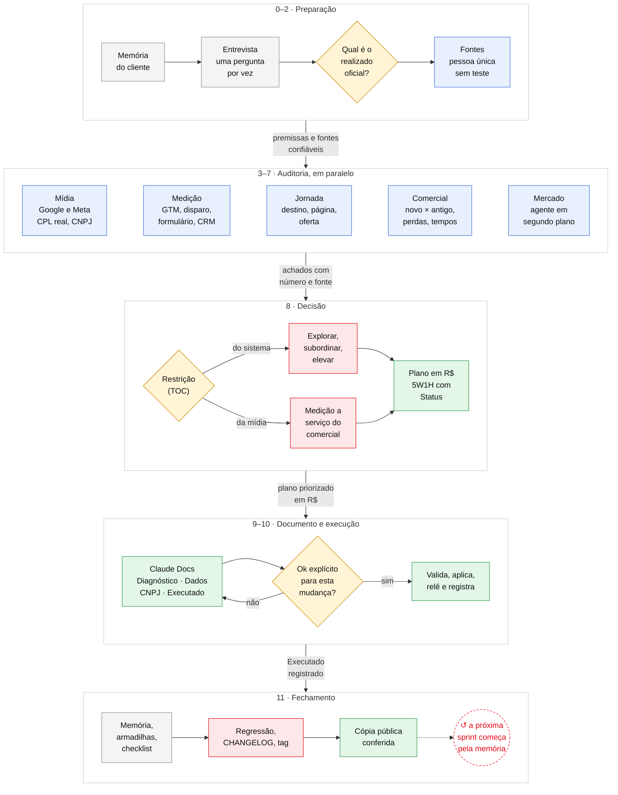

# sprint-growth

 

Skill do Claude Code para a **sprint growth** de cliente de agência: audita a jornada inteira, do tráfego à venda,
acha a restrição do sistema pela Teoria das Restrições e entrega um plano 5W1H priorizado por impacto em receita,
com as correções executadas pelas MCPs (Google Ads, GTM, GA4) e registradas numa aba "Executado".

- Mídia: Google Ads pela API (conversões, invasão, lances, índice de qualidade, parcela, sitelinks, destinos,
  termos e negativas) e Meta por export (criativo × qualidade do lead, inclusive CNPJ na Receita).
- Medição: GTM web e servidor contra as conversões da conta, disparo real das tags e envio do formulário
  interceptado (sem criar lead); origem do anúncio até o CRM.
- Jornada e comercial: destino, on-page, formulário, CRM (DataCrazy pela API), lead novo × cliente antigo, motivos
  de perda, time e tempo de cada etapa.
- Receita: realizado da fonte oficial, CPL real por pessoa única da mídia paga, breakeven pela skill
  `projecao-breakeven`.

## Workflow

Legenda: cinza = informação ou registro · amarelo = decisão · azul = análise · verde = entrega ·
vermelho = trava ou prioridade · ↺ = onde o loop se fecha. Na seta entre as fases, a saída de cada uma.

## Estrutura

- `SKILL.md`: o roteiro em 12 etapas (0 a 11).
- `referencias/`: armadilhas (40+ casos), checklist, priorização (TOC + impacto em R$), documento, execução,
  ferramentas (MCPs, BrasilAPI, DataCrazy) e negativas base.
- `scripts/`:
  - `mcp_http.py`, `ads_auditoria.py`, `termos_negativas.py`, `ads_escrita.py`: Google Ads;
  - `gtm_auditoria.py`, `teste_disparo.py`, `teste_formulario.py`: medição;
  - `leads.py`: pessoa única, teste e canal;
  - `datacrazy.py`: CRM (download, histórico, novo × antigo);
  - `cnpj.py`: qualificação B2B pela Receita;
  - `publicar.py`: gera a cópia pública.
- `templates/cliente/` e `tests/regressao.py`.

Dados de cliente e configuração das MCPs nunca entram neste repositório.
