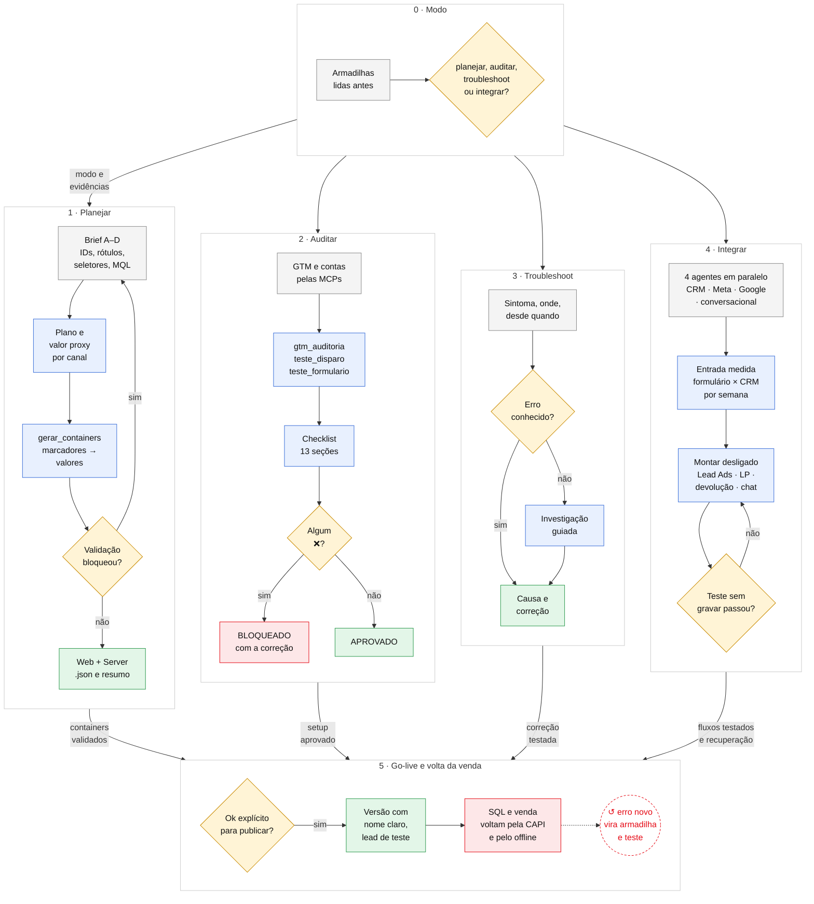

# tracking-e-integracoes

 

Skill do Claude Code que planeja, audita e conserta o tracking e as integrações do cliente: GTM Web e Server
(Stape), Meta Pixel e CAPI deduplicados, Google Ads, GA4, o lead entrando no CRM (formulário, LP, Lead Ads do Meta
direto no n8n, WhatsApp/Chatwoot) e a venda voltando às plataformas (SQL e venda do CRM ao Meta pela CAPI e ao Google
Ads pela Data Manager API). Tem agentes por frente — CRM, Meta, Google Ads e conversacional — que mapeiam a jornada em
paralelo. Tracking só está pronto quando o lead entra e a venda volta.

Antes `tracking-web-and-capi` (até a v1.2.3).

## Workflow

Ver o desenho detalhado (fases, decisões e travas)

Legenda: cinza = informação · amarelo = decisão · azul = análise ou script · verde = entrega · vermelho = trava ·
↺ = onde o loop se fecha. Na seta entre as fases, a saída de cada uma.

## Agentes de integração

| Agente | Frente | Responde |
|---|---|---|
| `integracao-crm` | Kommo, RD Station CRM, HubSpot, Pipedrive, DataCrazy, NectarCRM, GoHighLevel | Todo lead entra com origem e sem duplicar? Etapas por funil? Aviso de etapa e devolução? |
| `integracao-meta` | Lead Ads, app próprio, CAPI, sGTM | Por onde o lead do formulário chega ao CRM, com id e campanha? A venda volta ao Meta? |
| `integracao-google-ads` | Conversões de importação, Data Manager | gclid no CRM, conversões certas, envio validado? |
| `integracao-conversacional` | Chatwoot, IA de SDR, WhatsApp do CRM | Eventos gravados, cruzados com a origem, aguentando rajada? |

Só leem. A correção volta com risco (R1–R3), teste antes e como desfazer; quem aplica é a conversa principal, com
ok do usuário.

## O contrato de eventos

O detalhe está em [`canonico/padrao-tracking.md`](canonico/padrao-tracking.md).

## Como funciona

Uma linha por fase do desenho. "Trava" é o que impede a fase seguinte; o detalhe completo está no
[protocolo](latest.md).

| Fase | Entra | O que a skill faz | Ferramenta | Sai | Trava |
|---|---|---|---|---|---|
| **0 · Modo** | O pedido do usuário | Lê as armadilhas e pergunta o modo: planejar, auditar, troubleshoot ou integrar | [`referencias/armadilhas.md`](referencias/armadilhas.md) | Modo e lista de evidências a pedir | Nada segue sem o modo |
| **1 · Planejar: brief** | Cliente, funil, stack; Pixel, Ads, GA4, rótulos, URL do Stape, domínio, WhatsApp, seletores do formulário, regra de MQL | Pergunta em blocos (A a D), sem assumir valor; o token da CAPI **não** é pedido | [`templates/brief_exemplo.json`](templates/brief_exemplo.json) | `clientes/<c>/brief.json` | Valor crítico faltando |
| **1 · Planejar: plano** | Ticket, margem, taxas do funil por canal | Valor proxy de cada evento (Modelo A: lucro × taxas seguintes), diferente por canal | [`canonico/padrao-tracking.md`](canonico/padrao-tracking.md) | Plano: stack, eventos, valores, caminho Sheets ou CRM | Stack obrigatória incompleta |
| **1 · Planejar: containers** | O brief | Preenche os marcadores dos templates; tira MQL e Clarity quando não se aplicam; valida | [`scripts/gerar_containers.py`](scripts/gerar_containers.py) | `gtm-web-<c>.json`, `gtm-server-<c>.json`, `resumo.md` | Qualquer BLOQUEANTE: rótulo trocado ou repetido, URL de exemplo, Test Event Code em produção, marcador sobrando |
| **2 · Auditar: leitura** | Links dos containers e das contas | Lê GTM, Google Ads e GA4 direto pelas MCPs do n8n, sem pedir export | MCPs GTM, Google Ads, GA4 Admin | Containers e conversões da conta | Acesso negado |
| **2 · Auditar: testes** | URL da página, rótulos da conta | Compara tags com a conta (G1–G5), prova o disparo sem criar lead, mostra o que o formulário envia | `sprint-growth/scripts/`: `gtm_auditoria.py`, `teste_disparo.py`, `teste_formulario.py` | Alertas com a tag e o número | — |
| **2 · Auditar: decisão** | Evidências + alertas | Marca cada item do checklist como ✅, ⚠️ ou ❌ | [`canonico/checklist-auditoria.md`](canonico/checklist-auditoria.md) (14 seções) | APROVADO ou BLOQUEADO com a correção de cada ❌ | Um ❌ bloqueia o go-live |
| **3 · Troubleshoot** | Sintoma, onde aparece, desde quando, o que mudou | Procura na tabela de erros conhecidos; se não bater, investigação guiada | Tabela do [protocolo](latest.md) + armadilhas | Causa, correção em passos, como validar | Correção sem teste |
| **4 · Integrar: mapa** | Acessos do CRM, n8n, Meta, Google, Chatwoot | 4 agentes em paralelo (só leitura), cada um devolve achados com número, correção, risco e como desfazer | [`agentes/`](agentes/), [`contrato_integracao.md`](referencias/contrato_integracao.md) | Mapa da jornada: quem cria o lead, o que quebrou e desde quando | Agente não fala com o usuário: o que falta vem em `perguntas` |
| **4 · Integrar: entrada** | Leads do formulário pela credencial de Lead Ads; contatos do CRM | Cruza por telefone, semana a semana e por origem | [`n8n_meta_leads.py`](scripts/n8n_meta_leads.py), [`auditar_entrada.py`](scripts/auditar_entrada.py) | Semana em que a integração parou e leads fora do CRM | Planilha não prova que o CRM recebe |
| **4 · Integrar: montar e testar** | Decisões do usuário (etapas, valores, entrada, recuperação) | Lead Ads direto no n8n pelo app próprio, LP com gclid, devolução, chat com índice e fila; tudo desligado e testado sem gravar | [`meta-lead-ads.md`](implementacoes/meta-lead-ads.md), [`google-ads-offline.md`](implementacoes/google-ads-offline.md), [`conversacional-chatwoot.md`](implementacoes/conversacional-chatwoot.md), [`crm-conectores.md`](implementacoes/crm-conectores.md) | Fluxos prontos e provados | Credencial sem Connect; teste sem gravar falhando |
| **5 · Go-live** | Containers aprovados | Publica só com ok explícito, versão com nome claro; lead de teste ponta a ponta | GTM (pela MCP, com ok) | Versão publicada e lead de teste conferido em Meta, GA4, Ads e planilha/CRM | Test Event Code ativo; token no lugar errado |
| **5 · Volta da venda** | Status do lead na planilha ou no CRM (bloco `devolucao` do brief) | SQL e venda voltam às plataformas: webhook do Kommo → n8n → Meta (CAPI direta ou pelo sGTM, com o id do lead do formulário achado pelo telefone) e Google Ads pela Data Manager API; recuperação em lote do que ficou fora; retroativos que ainda cabem na janela (Meta 7 dias, Google 90/63) com a hora real da etapa; nota no lead a cada envio | [`scripts/devolucao.py`](scripts/devolucao.py), [`scripts/retroativos.py`](scripts/retroativos.py), [`implementacoes/crm-kommo.md`](implementacoes/crm-kommo.md), Apps Script ([`templates/planilha/`](templates/planilha/)) | Workflow do n8n, peças do sGTM, plataformas otimizando por venda | Sem leadgen_id, gclid ou fbclid gravado no lead |
| **↺ Fechamento** | Erro novo visto em cliente | Vira armadilha, linha na tabela de erros, item do checklist e caso de teste | [`tests/regressao.py`](tests/regressao.py) | Nova versão com tag | Regressão falhando |

## O que a skill nunca faz

- Guardar segredo (token da CAPI, do CRM, chave de app, API do n8n) em arquivo do repositório, brief, chat ou print.
- Ligar workflow, gravar em CRM ou conta de anúncios sem ok explícito e sem teste sem gravar antes.
- Excluir automação sem backup, ou achar que planilha recebendo prova que o CRM recebe.
- Copiar o container de outro cliente: todo container sai dos templates com marcadores, pelo gerador.
- Publicar GTM ou mexer em conta de cliente sem ok explícito para aquela mudança.
- Dar o tracking por pronto só com Lead: pronto é quando a venda volta às plataformas.

## Estrutura

- `SKILL.md` e `latest.md`: o protocolo dos quatro modos.
- `agentes/`: `integracao-crm`, `integracao-meta`, `integracao-google-ads`, `integracao-conversacional` (instalados
  por `scripts/instalar_agentes.py`), com o contrato em `referencias/contrato_integracao.md`.
- `referencias/armadilhas.md`: erros vistos em cliente (tags, página e consentimento, conta e GA4, volta da venda).
- `canonico/`: padrão de tracking (contrato de dados) e checklist de auditoria.
- `templates/gtm/` (containers com marcadores e o Data Client), `templates/devolucao/nucleo.js` (evento de CRM), `templates/brief_exemplo.json`, `templates/planilha/` (planilha de leads e Apps Script).
- `scripts/desenhos.py`: gera os desenhos animados de `assets/`.
- `scripts/gerar_containers.py`, `scripts/devolucao.py` (CRM → n8n → Meta e Google), `scripts/auditar_entrada.py`,
  `scripts/n8n_meta_leads.py`, `scripts/retroativos.py` (etapas antigas que ainda cabem na janela), `scripts/devolucao_planilha.py` (MQL da planilha ao Google, sem CRM), `scripts/instalar_agentes.py`
  e `tests/regressao.py` (105 casos, sem rede).
- `implementacoes/` (Sheets, Kommo/devolução, Lead Ads do Meta, Google Ads offline, conversacional, conectores de CRM), `playbook/` (caso piloto), `aula/`.

Os testes de disparo e de formulário são da skill [`sprint-growth`](../sprint-growth/). Parte do
[growth-enginner](../README.md). Dados de cliente nunca entram neste repositório.
