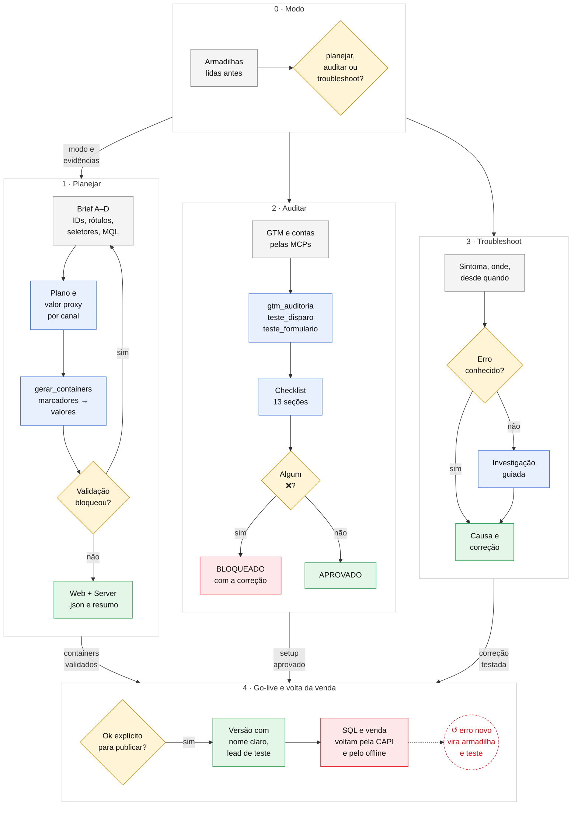

# tracking-web-and-capi

 

Skill do Claude Code que planeja, audita e conserta o tracking do cliente: GTM Web e Server (Stape), Meta Pixel e
CAPI deduplicados, Google Ads, GA4 e o caminho do lead até a planilha ou o CRM, com a venda voltando às plataformas.
Tracking só está pronto quando a venda volta.

## Workflow

Legenda: cinza = informação · amarelo = decisão · azul = análise ou script · verde = entrega · vermelho = trava ·
↺ = onde o loop se fecha. Na seta entre as fases, a saída de cada uma.

## Como funciona

Uma linha por fase do desenho. "Trava" é o que impede a fase seguinte; o detalhe completo está no
[protocolo](latest.md).

| Fase | Entra | O que a skill faz | Ferramenta | Sai | Trava |
|---|---|---|---|---|---|
| **0 · Modo** | O pedido do usuário | Lê as armadilhas e pergunta o modo: planejar, auditar ou troubleshoot | [`referencias/armadilhas.md`](referencias/armadilhas.md) | Modo e lista de evidências a pedir | Nada segue sem o modo |
| **1 · Planejar: brief** | Cliente, funil, stack; Pixel, Ads, GA4, rótulos, URL do Stape, domínio, WhatsApp, seletores do formulário, regra de MQL | Pergunta em blocos (A a D), sem assumir valor; o token da CAPI **não** é pedido | [`templates/brief_exemplo.json`](templates/brief_exemplo.json) | `clientes/<c>/brief.json` | Valor crítico faltando |
| **1 · Planejar: plano** | Ticket, margem, taxas do funil por canal | Valor proxy de cada evento (Modelo A: lucro × taxas seguintes), diferente por canal | [`canonico/padrao-tracking.md`](canonico/padrao-tracking.md) | Plano: stack, eventos, valores, caminho Sheets ou CRM | Stack obrigatória incompleta |
| **1 · Planejar: containers** | O brief | Preenche os marcadores dos templates; tira MQL e Clarity quando não se aplicam; valida | [`scripts/gerar_containers.py`](scripts/gerar_containers.py) | `gtm-web-<c>.json`, `gtm-server-<c>.json`, `resumo.md` | Qualquer BLOQUEANTE: rótulo trocado ou repetido, URL de exemplo, Test Event Code em produção, marcador sobrando |
| **2 · Auditar: leitura** | Links dos containers e das contas | Lê GTM, Google Ads e GA4 direto pelas MCPs do n8n, sem pedir export | MCPs GTM, Google Ads, GA4 Admin | Containers e conversões da conta | Acesso negado |
| **2 · Auditar: testes** | URL da página, rótulos da conta | Compara tags com a conta (G1–G4), prova o disparo sem criar lead, mostra o que o formulário envia | `sprint-growth/scripts/`: `gtm_auditoria.py`, `teste_disparo.py`, `teste_formulario.py` | Alertas com a tag e o número | — |
| **2 · Auditar: decisão** | Evidências + alertas | Marca cada item do checklist como ✅, ⚠️ ou ❌ | [`canonico/checklist-auditoria.md`](canonico/checklist-auditoria.md) (13 seções) | APROVADO ou BLOQUEADO com a correção de cada ❌ | Um ❌ bloqueia o go-live |
| **3 · Troubleshoot** | Sintoma, onde aparece, desde quando, o que mudou | Procura na tabela de erros conhecidos; se não bater, investigação guiada | Tabela do [protocolo](latest.md) + armadilhas | Causa, correção em passos, como validar | Correção sem teste |
| **4 · Go-live** | Containers aprovados | Publica só com ok explícito, versão com nome claro; lead de teste ponta a ponta | GTM (pela MCP, com ok) | Versão publicada e lead de teste conferido em Meta, GA4, Ads e planilha/CRM | Test Event Code ativo; token no lugar errado |
| **4 · Volta da venda** | Status do lead na planilha ou no CRM | SQL e venda voltam às plataformas: Purchase pela CAPI, Google Ads offline (API ou CSV) | Apps Script ([`templates/planilha/`](templates/planilha/)), webhook do CRM | Plataformas otimizando por venda | Sem gclid/fbclid gravado no lead |
| **↺ Fechamento** | Erro novo visto em cliente | Vira armadilha, linha na tabela de erros, item do checklist e caso de teste | [`tests/regressao.py`](tests/regressao.py) | Nova versão com tag | Regressão falhando |

## O que a skill nunca faz

- Guardar o token da CAPI em arquivo, brief, chat ou print: ele vai direto no GTM Server.
- Copiar o container de outro cliente: todo container sai dos templates com marcadores, pelo gerador.
- Publicar GTM ou mexer em conta de cliente sem ok explícito para aquela mudança.
- Dar o tracking por pronto só com Lead: pronto é quando a venda volta às plataformas.

## Estrutura

- `SKILL.md` e `latest.md`: o protocolo dos três modos.
- `referencias/armadilhas.md`: erros vistos em cliente (tags, página e consentimento, conta e GA4, volta da venda).
- `canonico/`: padrão de tracking (contrato de dados) e checklist de auditoria.
- `templates/gtm/` (containers com marcadores), `templates/brief_exemplo.json`, `templates/planilha/` (planilha de leads e Apps Script).
- `scripts/gerar_containers.py` e `tests/regressao.py` (37 casos, sem rede).
- `implementacoes/` (Sheets, Kommo), `playbook/` (caso piloto), `aula/`.

Os testes de disparo e de formulário são da skill [`sprint-growth`](../sprint-growth/). Parte do
[growth-enginner](../README.md). Dados de cliente nunca entram neste repositório.
